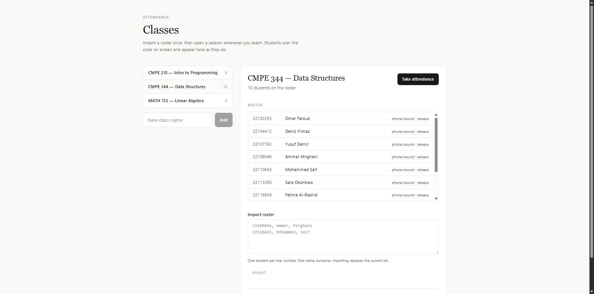
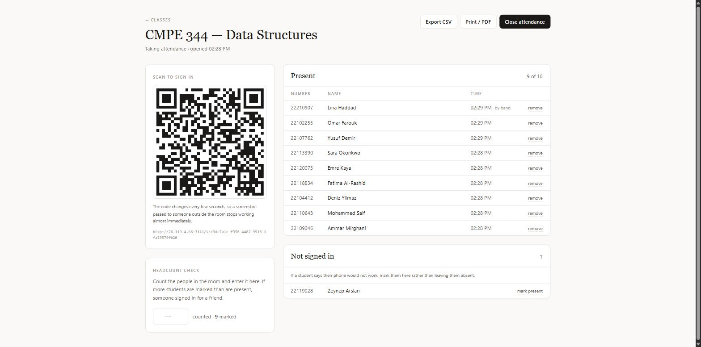
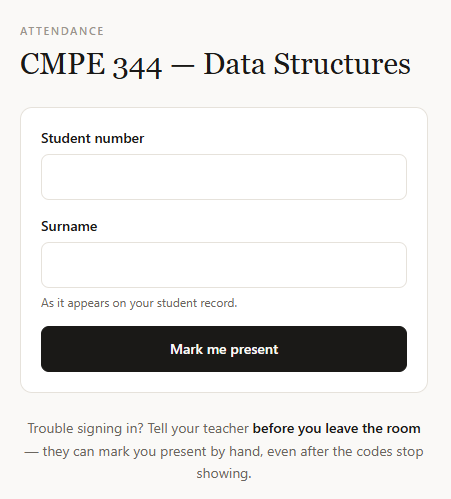
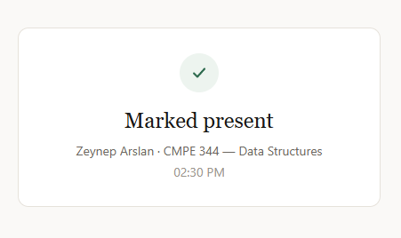
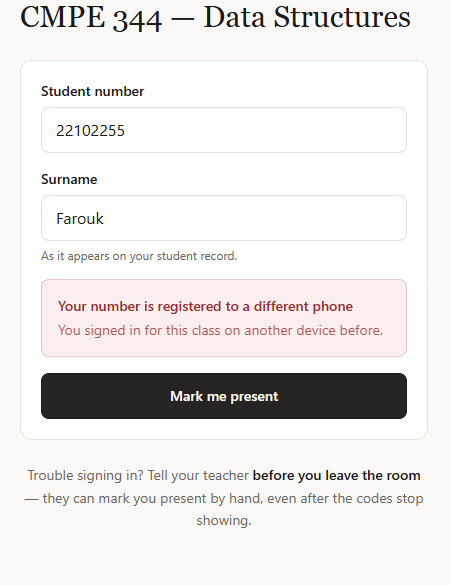
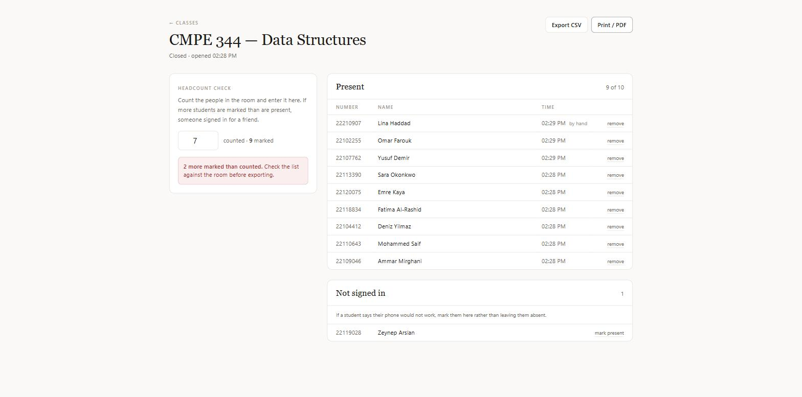

# Attendance

Classroom attendance by QR code.

The teacher projects a code that changes every 10 seconds. Students scan it and sign in from their phones. One phone, one student, one session.

Built for a university hackathon, rebuilt from scratch. The original is kept at the [`v0-hackathon`](../../tree/v0-hackathon) tag.

---

## The teacher screen

Classes, rosters, and phone bindings in one place.



Open a session and the code starts rotating. Students appear live as they scan — no refreshing.



---

## The student screen

Scan, type your number and surname, done.




Sign in for a friend and it stops you.



---

## The headcount check

Cryptography cannot see the room. A student can still carry a friend's phone in.

So the app asks how many people you actually counted, and compares.



---

## Features

**Taking attendance**
- Rotating QR code, new one every 10 seconds
- Students appear live on your screen as they scan
- Import a roster by pasting `number, first name, surname`
- Multiple classes, one roster each
- Mark anyone present by hand
- Close the session when you're done

**Stopping cheating**
- Codes expire in ~20 seconds — a screenshot is useless
- One phone can only mark one student, per class
- One student number can only be used from one phone
- Only students on the roster can sign in
- Surname must match the number
- Headcount check catches proxies the app can't see

**Getting the data out**
- CSV export, opens in Excel
- Print / PDF view
- Present and absent both recorded
- Hand-marked rows labelled `manual`, so an audit can tell them apart

**Practical**
- Runs on your laptop, no accounts, no cloud
- Students just need the same WiFi
- Data stays in a local SQLite file
- One command to start

---

## Run it

```bash
npm install
npm run dev
```

Teacher screen: <http://localhost:5173>
Students: the address printed in the terminal.

Single process:

```bash
npm run build
npm start
```

---

## How the security works

### Codes that expire

The old version stored the code in a variable with no expiry. A screenshot worked until the next rotation.

Now each session gets a secret, and the code is derived from it:

```
code = HMAC-SHA256(sessionSecret, sessionId | floor(now / 10s))
```

- Nothing is stored, so nothing can be stolen
- Valid for the current window and the one before — about 20 seconds
- No shared mutable state, so rotation can't race a submission
- Compared in constant time

Twenty seconds is not long enough to type your number, so the code is swapped once on page load for a **pass** — signed, bound to your phone, good for 5 minutes. Send the pass to a friend and it fails, because their phone hash won't match.

### One phone, one student

The old version deduplicated by IP address. On campus WiFi the whole class shares one address, so the first student would have locked out everyone else. Switching to mobile data defeated it anyway.

Now each browser holds a random ID in a signed, httpOnly cookie. Only its SHA-256 is stored.

The rules are database constraints, not `if` statements — they can't be raced or forgotten:

| Constraint | Stops |
|---|---|
| `attendance (session_id, student_id)` | a student marked twice |
| `attendance (session_id, device_hash)` | one phone marking twice |
| `device_claims (class_id, student_id)` | a student using a second phone |
| `device_claims (class_id, device_hash)` | a phone used for a second student |

First scan binds a number to a phone for the whole class. Teacher can release it when someone gets a new phone.

Every rejection is decided before anything is written, so a failed scan never leaves a binding behind.

### Roster identity

Anyone could previously type any student number. Now the number must be on the roster and the surname must match.

### What it doesn't stop

- **Carrying a friend's phone in.** That's what the headcount is for.
- **Clearing cookies.** A deterrent, not a proof. Headcount again.

Students who can't sign in are told to speak to the teacher before leaving. The teacher can mark them by hand.

### Other measures

- Teacher API is **loopback only** — there is no password by design, so students on the WiFi get a 403 on everything but the scan page
- Strict CSP, no CDN scripts, everything bundled
- No `xlsx` or `jsPDF` — the original pulled in `xlsx@0.18.5`, which has prototype-pollution advisories and is unmaintained. Export is plain CSV plus a print stylesheet
- CSV fields quoted, leading `=` `+` `-` `@` escaped, so a crafted name can't become a live formula
- Zod on every request boundary
- Rate limiting on the scan endpoint

---

## Stack

TypeScript everywhere.

| | |
|---|---|
| Server | Hono on Node |
| Database | SQLite via Drizzle |
| Client | React, Vite, Tailwind |
| Live updates | Server-sent events |
| Tests | Vitest |

```
server/
  lib/        codes, passes, device cookies, rate limiting, headers
  services/   the scan decision, roster parsing, queries, export
  routes/     teacher API (loopback only), public scan API
  db/         schema and connection
src/          teacher dashboard, session screen, scan page
shared/       types used by both sides
tests/        the security core
```

---

## Tests

```bash
npm test
```

28 tests, covering the places where a bug means wrong attendance:

- Code rotation, expiry, and forged codes
- Passes bound to the wrong phone or wrong session
- Wrong surname, unknown number, closed session
- Second phone, second student
- A rejected scan leaving no binding behind

---

## Credits

Built for a hackathon at Cyprus International University by Ammar Mirghani, Mohammed Saif and Lina.

MIT.
